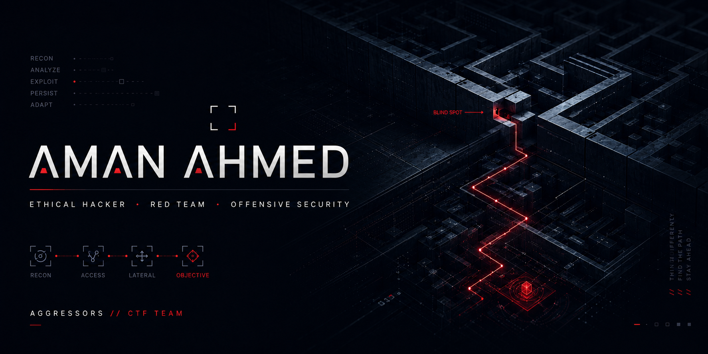

# ⚡ AMAN AHMED

<div align="center">


<br><br>



<br><br>

<a href="https://github.com/amanahmed-dotcom">

</a>

<a href="YOUR_LINKEDIN_URL">

</a>

</div>

---

## 🛡️ About Me

I'm **Aman Ahmed**, a Cybersecurity student focused on understanding how systems, networks, and applications behave under real-world security conditions.

My work sits at the intersection of:

**Network Security** · **Digital Forensics** · **Security Automation** · **Linux** · **Vulnerability Research**

I enjoy turning security concepts into practical projects — from building analysis tools and security scanners to studying network traffic, system behavior, and defensive architectures.

> **Understand the system. Find the weakness. Validate the risk. Build the defense.**

---

## 🎯 Current Focus

```text
┌───────────────────────────────────────────────────────────┐
│                     SECURITY FOCUS                         │
├───────────────────────────────────────────────────────────┤
│                                                           │
│  🔍 Network Security                                      │
│     └─ Traffic Analysis • Network Visibility • Recon      │
│                                                           │
│  🕵️ Digital Forensics                                     │
│     └─ Evidence Analysis • System Artifacts • Investigation│
│                                                           │
│  🐧 Linux Security                                        │
│     └─ Hardening • System Analysis • Security Automation  │
│                                                           │
│  🤖 Security Automation                                   │
│     └─ Python • Bash • Analysis Tools • Security Scripts  │
│                                                           │
│  🌐 Web Security                                           │
│     └─ Vulnerability Assessment • Secure Architecture     │
│                                                           │
└───────────────────────────────────────────────────────────┘
```

---

## 🧰 Security Toolkit

### 💻 Operating Systems


### 🌐 Network Security & Analysis


### 🐍 Programming & Automation


### 🔐 Security Research


---

## 🚀 Featured Security Projects

### 🛡️ Malware Sandbox

A dynamic malware-analysis environment designed to execute programs in an isolated environment and observe system behavior.

**Focus:** `Docker` · `Linux` · `strace` · `Behavioral Analysis` · `Security Automation`

---

### 📡 WiFi Auditor

A modular toolkit for **authorized wireless security auditing and network analysis**, combining shell automation, Python modules, and automated testing.

**Focus:** `Linux` · `Wireless Security` · `Python` · `Bash` · `Network Analysis`

---

### 🌐 WebScan

A modular web security assessment framework combining reconnaissance, crawling, security checks, vulnerability analysis, and automated reporting.

**Focus:** `Python` · `C++` · `Web Security` · `Reconnaissance` · `Security Reporting`

---

## 🏴‍☠️ CTF & Security Community

### **AGGRESSORS // CTF TEAM**

A collaborative security community focused on **CTF challenges, practical cybersecurity learning, and continuous skill development**.

---

## 🧠 Learning Roadmap

```text
                    ┌───────────────────┐
                    │   CYBERSECURITY   │
                    └─────────┬─────────┘
                              │
              ┌───────────────┼───────────────┐
              │               │               │
              ▼               ▼               ▼
        Network Security  Web Security   Digital Forensics
              │               │               │
              └───────────────┼───────────────┘
                              │
                              ▼
                     Security Automation
                              │
                              ▼
                      Security Engineering
```

### 📚 Currently Exploring

- [x] Linux fundamentals
- [x] Network reconnaissance
- [x] Network traffic analysis
- [x] Security scripting
- [x] Vulnerability assessment concepts
- [x] Security-focused Python development
- [ ] Advanced digital forensics
- [ ] Advanced network defense
- [ ] Security architecture
- [ ] Professional penetration testing methodologies
- [ ] Incident response workflows

---

## 🏆 2026 Mission

> **Build a portfolio that demonstrates real security engineering ability — not just tool usage.**

My goal is to create projects that show:

- 🔍 Ability to investigate security problems
- 🧠 Understanding of how systems actually work
- 🛠️ Ability to build practical security tooling
- 📊 Ability to analyze and communicate findings
- 🔐 Ability to design stronger defensive architectures

---

## 📊 GitHub Activity

<div align="center">


</div>

---

## 📈 Contribution Activity

<div align="center">


</div>

---

## 🧭 My Security Philosophy

```text
     OBSERVE
        │
        ▼
     ANALYZE
        │
        ▼
     UNDERSTAND
        │
        ▼
     VALIDATE
        │
        ▼
     SECURE
        │
        ▼
     AUTOMATE
```

> **Security isn't a feature added at the end.**
>
> **It's a mindset built into every layer of the architecture.**

---

## 🤝 Let's Connect

I'm always interested in connecting with people who are passionate about:

- Cybersecurity
- Network Security
- Digital Forensics
- Security Engineering
- Open Source
- CTFs
- Security Research

<div align="center">

<a href="https://github.com/amanahmed-dotcom">

</a>

<a href="YOUR_LINKEDIN_URL">

</a>

</div>

---

<div align="center">

### 🔐 BUILD. ANALYZE. SECURE.

<sub>Security research • Defensive engineering • Continuous learning</sub>

<br><br>


</div>
